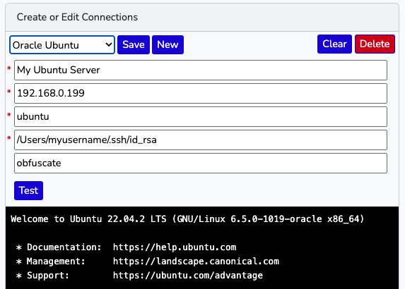

# Batch

Laravel app to process shell commands in a batch.

## Requirements:
**Batch** was created in **Laravel version 11.x** and requires the following:

* **PHP** >= 8.1
* **Composer** >= 2.5.5
* **npm** >= 9.7.2

## Installation:
Install **Batch** locally with the following command:

`git clone git@github.com:mpemburn/batch.git`

Change to the `batch` directory and run:

`composer install`

...to install the PHP dependencies.

Copy `.env.example` to `.env` and add the credentials for your Mysql:
```
DB_CONNECTION=mysql
DB_HOST=127.0.0.1
DB_PORT=3306
DB_DATABASE=batch
DB_USERNAME=[username]
DB_PASSWORD=[password]
```
Then:

`php artisan key:generate`

...to add the application keys to `.env`

`npm install`

...to install modules needed to compile the JavaScript and CSS assets.

`npm run build`

...to do the asset compiling.

After creating the `batch` database in Mysql, run migration to create the data tables:

`php artisan migrate`

You will need to run a web server to run **Batch** in a browser.
I recommend [**Laravel Valet**](https://laravel.com/docs/10.x/valet), but you can do it simply by going to the project
directory and running:

`php artisan:serve`

This will launch a server on `http://127.0.0.1:8000`

## How to Use Batch:

### Connections ###

Once you have **Batch** running in a browser, you will first need
to create a user account by clicking on **Register** in the top
right corner.

Once logged in, you'll need to define at least one **Connection**
before you can use **Batch**:


The fields, **Connection Name**, **Host Name or IP**, **User Name**, and **Path to Public Key** are required
but the **Pass Phrase** is needed only if you have set one when you
generated the `ssh` key.  Once you've defined the credentials, click
the **Test** button.  If all is correct, you will connect to your server.
You can the click **Save** and the connection will be available
in **Batch**.

